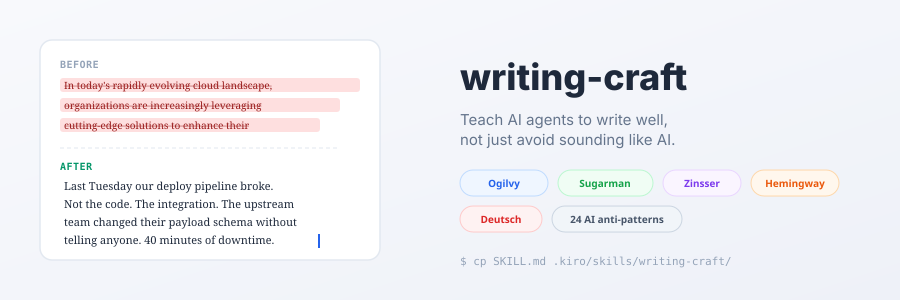

<p align="center">
  
</p>

<div align="center">

**Teach AI agents to write well, not just avoid sounding like AI.**


[Quick start](#quick-start) · [See it work](#see-it-work) · [What's inside](#whats-inside) · [How it's different](#how-its-different) · [Voice calibration](#voice-calibration) · [License](#license)

</div>

---

One file that teaches your AI agent how sentences work. Word choice, rhythm, loss framing, the slippery slide, and 24 patterns to catch when the output drifts back toward safe and smooth.

I built this because I kept pasting the same editing instructions into every session. Fix the hedge words. Cut the throat-clearing. Make it concrete. One file that carries those rules everywhere was overdue.

Models are trained to produce text that's pleasant to skim and hard to disagree with. RLHF rewards smooth, safe, hedged prose. This skill produces the opposite: writing that takes a position, names a specific failure, and rewards readers who pay attention.

## See it work

Same idea, run through edit mode. The input passes most AI detectors. It still reads like nobody wrote it.

**Before** (the AI first draft):

> In today's rapidly evolving development landscape, leveraging AI coding assistants has become increasingly crucial. These powerful tools can significantly enhance developer productivity and streamline workflows, empowering teams to focus on what truly matters.

**After** (edit mode output):

> AI coding assistants handle the boring parts: boilerplate, test scaffolds, the third CRUD endpoint that looks like the first two. They will not decide what to build for you. That part is still yours.

The skill flagged six tells in the first version (`in today's`, `landscape`, `leveraging`, `crucial`, `enhance`, `empowering`), then rewrote for a concrete claim instead of swapping synonyms. <!-- vrm-ignore: names AI-vocab tells on purpose -->

## Quick start

### Skills CLI (works with Claude Code, Cursor, Codex, Kiro, and 50+ agents)

```bash
npx skills add vidanov/writing-craft-skill
```

Install to a specific agent:

```bash
npx skills add vidanov/writing-craft-skill --agent claude-code
npx skills add vidanov/writing-craft-skill --agent cursor
npx skills add vidanov/writing-craft-skill --agent kiro-cli
```

Install globally (available in all projects):

```bash
npx skills add vidanov/writing-craft-skill --global
```

### Any AI assistant (ChatGPT, Claude Projects, internal agents)

No CLI required. Works with any AI that supports custom instructions:

1. Copy the prompt from [`chatgpt/PROMPT.md`](chatgpt/PROMPT.md) into your assistant's system prompt or custom instructions
2. Start writing

### Manual (single file copy)

```bash
# Project-level (shared via git)
mkdir -p .kiro/skills/writing-craft
cp SKILL.md .kiro/skills/writing-craft/SKILL.md

# Or user-level (all projects)
mkdir -p ~/.kiro/skills/writing-craft
cp SKILL.md ~/.kiro/skills/writing-craft/SKILL.md
```

## What's inside

The skill has two modes.

**Write mode** drafts content from scratch using craft principles. Opens concrete, grounds every claim, closes with action.

**Edit mode** reviews existing text, flags problems, rewrites flagged passages. Triggered by "edit this," "review this," or `=C=` (grammar and clarity only).

### Craft principles (the generative half)

Classic copywriting applied to technical writing:

- 🔤 **Word choice** (Ogilvy/Halbert): "use" not "utilize," concrete nouns, active verbs, cut adverbs
- 📐 **Sentence craft** (Sugarman): the slippery slide, short first sentences, one idea per sentence
- 📄 **Paragraph craft** (Zinsser): lead with the point, one thought per paragraph, kill throat-clearing
- 🎵 **Rhythm** (Deutsch): copy works like music, vary length, reprise themes
- 🎯 **Loss framing**: frame what the reader loses by not acting, not what they gain
- 🔍 **Knowledge advantage**: specific frustration beats general benefit
- ✂️ **The editing principle**: "I'm not a great writer, but I'm a hell of an editor" (Ogilvy)

### Anti-pattern checklist (the defensive half)

24 categories of AI writing tells, organized by type:

| Category | Examples |
|----------|----------|
| **Vocabulary** (3 tiers) | delve, tapestry, leverage, robust, seamless, harness, foster, resonate <!-- vrm-ignore: exhibit of flagged words --> |
| **Structure** | Significance inflation, empty -ing phrases, "Despite" formula, copula avoidance |
| **Formatting** | Em dash overuse, bold-as-study-guide, inline-header lists |
| **Content** | Vague attribution, chatbot artifacts, "Let's explore," rhetorical questions |
| **Rhythm** | Sentence uniformity, paragraph uniformity, missing first-person, over-polishing |

## How it's different

|  | Pattern removal tools | This skill |
|--|----------------------|------------|
| **Goal** | "Don't sound like AI" | "Sound like a practiced author" |
| **Method** | Defensive (flag and swap) | Generative (craft principles) plus defensive (flag and swap) |
| **Voice** | Template profiles (casual/professional/blunt) | Calibrated to YOUR writing from a sample |
| **Writing** | Fixes existing text only | Writes from scratch AND fixes existing text |
| **Depth** | Word lists and structural flags | Why the writing fails and what to do instead |

## Voice calibration

The skill doesn't impose one voice. Give it a writing sample and it matches your patterns:

```
Match my voice, here's a recent post: [paste 3-5 paragraphs]
```

It analyzes sentence length, contraction rate, opening patterns, register, and recurring constructions. Then it enforces craft principles inside YOUR voice instead of a generic template.

See [`references/voice-calibration-guide.md`](references/voice-calibration-guide.md) for a full walkthrough on building a permanent voice profile.

## When NOT to use this

| Situation | Better choice |
|-----------|--------------|
| You need to bypass AI detectors (academic) | This is a craft tool, not a cheating tool |
| You want a grammar-only check | Use a grammar tool; this rewrites for craft |
| Your text is code documentation | Code docs need clarity, not voice; use plain style guides |
| You want longer, more detailed output | This skill cuts. It makes things shorter, not longer. |

## Extending

Add domain-specific rules in `references/`:

```
writing-craft/
├── SKILL.md
└── references/
    ├── voice-calibration-guide.md
    ├── your-industry-terms.md      # Terminology conventions
    └── your-style-overrides.md     # Company/publication style rules
```

The skill loads reference files when it detects relevant context.

## Contributing

Ideas welcome:

- Additional anti-patterns you've seen in AI output (with examples)
- Craft principles from other copywriting traditions
- Domain-specific reference files (legal writing, medical, finance)
- Translations (the skill matches input language, but the checklist is English-first)

## License

MIT. Use it, fork it, sell courses around it, put it in your product.

## Credits

Craft principles from David Ogilvy, Joseph Sugarman, William Zinsser, Gary Halbert, Ernest Hemingway, and David Deutsch.

AI anti-pattern research informed by Wikipedia WikiProject AI Cleanup, Liang et al. (Stanford, 2023), and community work including [avoid-ai-writing](https://github.com/conorbronsdon/avoid-ai-writing) and [humanizer](https://github.com/blader/humanizer).

---

If this saved you an editing round, a star ⭐ helps the next person find it.

## Also by the author

- [aws-architecture-diagram-skill](https://github.com/vidanov/aws-architecture-diagram-skill): generate AWS architecture diagrams as draw.io files with 270+ verified icons
- [shape](https://github.com/vidanov/shape): runtime governance for AI agents (phases, transactions, budget gates, proof traces)
